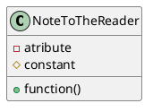

```plantuml
package "Server" {
	class Server {
		- current_popups: List[Popup]
		# event_handler: EventHandler
	}

	Server --> Popup

	class Popup {
		- type: int
		- text: str 
		- duration: int
		--types--
		# DEBUG = 0
		# INFO = 1
		# WARNING = 2
		# CRITICAL = 3
	}

	package "Event System" {
		class EventHandler {
			+ tick(time: int)
			----
			- event_que: list[Event]
			- event_pool: list[Event]
		}
		
		abstract class Event {
			# start_time: int
			- run_every: int = 0
			+ tick(time: int): bool
			--helpers--
			+ get_grid(grid: int, location: tuple[int, int]): Tile
			+ set_grid(grid: int, location: tuple[int, int], tile: Tile): None
			+ create_popup(type: int, text: str, duration: int)
			+ ...
			+ ...
		}
		
		EventHandler --> Event
		
		class RishiEvent extends Event {
			# start_time: int = 60  
			- run_every: int = 5
			+ tick(time: int): bool  
		}
		
		class MeteorEvent extends Event {
			# start_time: int = 120  
			+ tick(time: int): bool  
		}
	}
	Server --> EventHandler
}
```

## Server

### Event system

The entire event system is handled by the EventHandler class, it keeps two lists of events, those that are not currently being processed and those that are. Every 'tick' it checks all the events in the 'que', if any are due to start it moves them into the pool. It then goes over all the events in the event pool calling their 'tick' function, if they return False (or crash out) they are removed from the pool. If the events choose to redefine the `run_every` variable, the handler will skip ticking them for that many ticks, Note: this can be chan
ged by the tick function depending on the events current need, thus this could be used to _pause_ and event for x ticks

```plantuml
class MeteorEvent {
	# start_time: int = 120  
	+ tick(time: int): bool  
}
```

Events can be created by making a new class inheriting from Event and defining `start_time` and `tick`. The example `MeteorEvent` will start processing two minutes into the game, the `tick` function could then replace a random road tile for a broken road tile.

The reason for the `start_time`, `:bool`, and `run_every` are to save performance, some events might incur a heavy system load, like for example checking the relative location of specific buildings, these may not need to run every tick or at all during the first few minuets of the game. Giving Event's the ability to control this allows for significant optimization with minimal extra effort. 

