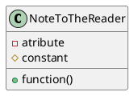

```plantuml
package "Server" {
	class Server {
		- CurrentPopups: List[Popup]
		# eventHandler: EventHandler
		# timeHandler: TimeHandler
		# simulation: Simulation
	}

	class Popup {
		- type: int
		- text: str 
		- duration: int
		--types--
		# DEBUG = 0
		# INFO = 1
		# WARNING = 2
		# CRITICAL = 3
	}
	
	Server --> Popup

	class TimeHandler {
		- startGame()
		- gameSeconds(): float
	}

	Server --> TimeHandler

	package "Event System" {
		class EventHandler {
			+ tick(time: int)
			----
			- event_que: list[Event]
			- event_pool: list[Event]
		}
		
		abstract class Event {
			# start_time: int
			- run_every: int = 0
			+ tick(time: int): bool
			--helpers--
			+ get_grid(grid: int, location: tuple[int, int]): Tile
			+ set_grid(grid: int, location: tuple[int, int], tile: Tile): None
			+ create_popup(type: int, text: str, duration: int)
			+ ...
			+ ...
		}
		
		EventHandler --> Event
		
		class RishiEvent extends Event {
			# start_time: int = 60  
			- run_every: int = 5
			+ tick(time: int): bool  
		}
		
		class MeteorEvent extends Event {
			# start_time: int = 120  
			+ tick(time: int): bool  
		}
	}
	Server --> EventHandler

	package "Simultion System" {
		class Simulation {
			+ get_student_satisfaction(): float[0..1]
			+ get_student_satisfaction_trend(): int[-2..2]
			+ get_number_students(): int
			+ get_number_students_trend(): int[-2..2]
			+ get_current_income(): float
			+ get_current_income_trend(): int[-2..2]
			+ get_current_balance(): float
		}
	}

	Server --> Simulation

}
```

## Server

### Event system

The entire event system is handled by the EventHandler class, it keeps two lists of events, those that are not currently being processed and those that are. Every 'tick' it checks all the events in the 'queue', if any are due to start it moves them into the pool. It then goes over all the events in the event pool calling their 'tick' function, if they return False (or crash out) they are removed from the pool. If the events choose to redefine the `run_every` variable, the handler will skip ticking them for that many ticks, Note: this can be changed by the tick function depending on the events current need, thus this could be used to _pause_ and event for x ticks

```plantuml
class MeteorEvent {
	# start_time: int = 120  
	+ tick(time: int): bool  
}
```

Events can be created by making a new class inheriting from Event and defining `start_time` and `tick`. The example `MeteorEvent` will start processing two minutes into the game, the `tick` function could then replace a random road tile for a broken road tile.

The reason for the `start_time`, `:bool`, and `run_every` are to save performance, some events might incur a heavy system load, like for example checking the relative location of specific buildings, these may not need to run every tick or at all during the first few minuets of the game. Giving Event's the ability to control this allows for significant optimisation with minimal extra effort. 

### Simulation System
The simulation system revolves around constantly updating average scores, every 'tick' the simulation will calculate all of the scores$^{1}$ and add the current scores to a list (removing the first if necessary), when the client (or simulation system) requests a variable like `number_students` what is actually returned is an average of this list. this helps smooth out the data when buildings are placed. this also adds the advantage of delayed feedback loops.

For example: if the player suddenly places lots of accommodation buildings the number of students would suddenly increase, but due to the averaging from the users point of view the student number would increase slowly until the building is 'full'. As the code that generates satisfaction also uses the averages we will get repacutions happening slowly

- user places large accommodation without proper 'support buildings'
- student numbers slowly rise causing student satisfaction to slowly drop (overcrouded utilities ect ect)
- student satisfaction dropping causes student numbers to drop
- delay causes equalisation to take multiple seconds
